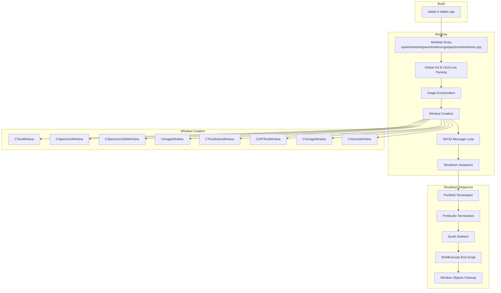
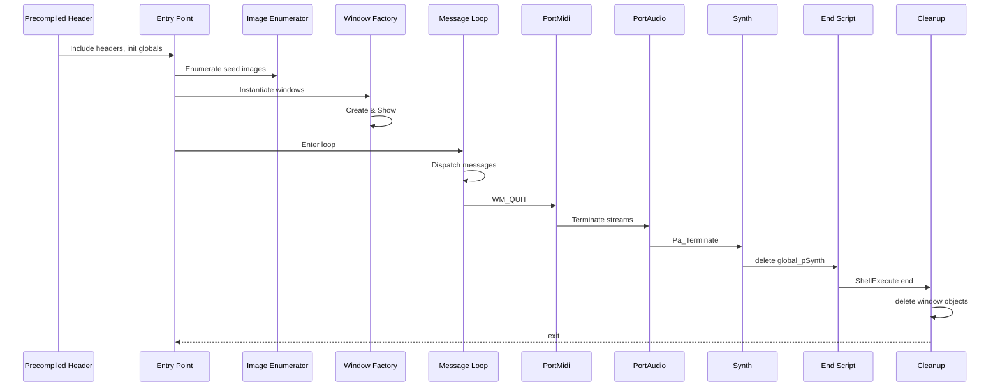

# 10. (Internal) App Structure & Key Modules (limited internals)

## 10.1 Main Startup Flow and Window Creation

### Overview

At launch, the application uses the precompiled header (`stdafx.h`/`stdafx.cpp`) to centralize commonly-used includes (Windows headers, CRT debug macros, MFC, FreeImage, PortAudio, PortMidi, Tonic, etc.) and speed up compilation.  The entry point in `spiwindowtransparentmidivoroguispectrumtimeframe.cpp` initializes global parameters (window size, alpha blending, script names), parses command-line arguments, optionally enumerates seed images, and creates a suite of Win32 GUI windows:

- CTextWindow (static text/slideshow)
- CSpectrumWindow (spectrum analysis)
- CSpectrum24bitWindow (24-bit spectrum)
- CImageWindow (image slideshow)
- CTimeframeWindow (OpenGL audio timeframe)
- CSPITextWindow (overlay text windows)
- CVorogsWindow (Voronoi-based visualizer)
- CVorossWindow (clustered Voronoi slideshow)

Each window is instantiated via its constructor, registered, `Create()`d, and `Show()`n.  Once all windows are up, the app enters the standard Win32 message loop.  On exit (WM_QUIT), it terminates PortMidi and PortAudio, deletes the synthesizer, invokes any “end” AHK script, and cleans up all window objects.

### Architecture Overview



### Detailed Startup Steps

1. **Precompiled Header**
2. `stdafx.h` includes system headers (`<windows.h>`, `<tchar.h>`, MFC headers, FreeImage, PortAudio, PortMidi, etc.) and debug macros (`DBG_NEW`) to speed up builds.
3. `stdafx.cpp` simply compiles `stdafx.h` into a PCH for reuse.

1. **Entry Point & Global Initialization**
2. In `spiwindowtransparentmidivoroguispectrumtimeframe.cpp`, global variables such as `global_x`, `global_y`, `global_alpha`, `global_titlebardisplay`, etc. are declared and defaulted.
3. Command-line arguments are parsed using `CommandLineToArgvA` to override defaults.
4. If `global_imagefolder` is set, a `DIR … > spiwtmvst_filenames.txt` system call populates `global_imagefilenames`.

1. **Font and Debug Setup**
2. Fonts are created via `CreateFontW` for static text windows.
3. A `spilogfile` may be instantiated for debug logging when enabled.

1. **Window Instantiation**

For each enabled window type, code follows the pattern:

– **Text Window**

```cpp
     global_pTextWindow = DBG_NEW CTextWindow(...);
     global_pTextWindow->Create();
     global_pTextWindow->Show();
```

– **Spectrum Window**

```cpp
     global_pSpectrumWindow = DBG_NEW CSpectrumWindow(...);
     global_pSpectrumWindow->Create();
     global_pSpectrumWindow->Show();
```

– **24-bit Spectrum Window**

```cpp
     global_pSpectrum24bitWindow = DBG_NEW CSpectrum24bitWindow(...);
     global_pSpectrum24bitWindow->Create();
     global_pSpectrum24bitWindow->Show();
```

– **Image Window**

```cpp
     global_pImageWindow = DBG_NEW CImageWindow(...);
     global_pImageWindow->Create();
     global_pImageWindow->Show();
```

– **Timeframe Window**

```cpp
     global_pTimeframeWindow = DBG_NEW CTimeframeWindow(...);
     global_pTimeframeWindow->Create();
     global_pTimeframeWindow->Show();
```

– **SPI Text Overlays**

A loop creates one or more `CSPITextWindow` instances, each with `Create()`/`Show()`

– **Voronoi GUI Window**

```cpp
     CVorogsWindow* pVorogsWindow = DBG_NEW CVorogsWindow(...);
     pVorogsWindow->Create();
     pVorogsWindow->Show();
     global_pVorogsWindow = pVorogsWindow;
```

– **Voronoi Slideshow Window**

```cpp
     CVorossWindow* pVorossWindow = DBG_NEW CVorossWindow(...);
     pVorossWindow->Create();
     pVorossWindow->Show();
     global_pVorossWindow = pVorossWindow;
```

1. **Win32 Message Loop**

The application then runs:

```cpp
   MSG msg;
   while ((status = ::GetMessage(&msg, 0, 0, 0)) != 0) {
     if (status == -1) break;
     ::TranslateMessage(&msg);
     ::DispatchMessage(&msg);
   }
```

### Shutdown Procedure

After `GetMessage` returns 0, the following cleanup occurs in sequence:

1. **PortMidi**
2. `global_active = false;`
3. `Pm_Close(global_pPmStreamMIDIIN);` / `Pm_Close(global_pPmStreamMIDIOUT);`
4. `Pt_Stop();` then `Pm_Terminate();`

1. **PortAudio**
2. `Pa_StopStream(global_stream);`
3. `Pa_CloseStream(global_stream);`
4. `Pa_Terminate();`
5. On errors, a `MessageBoxA` reports the failure

1. **Synth Cleanup**
2. `delete global_pSynth;` frees the Tonic/PolySynth instance.

1. **End Script Invocation**
2. If `global_end` is set, `ShellExecuteA(NULL, "open", global_end.c_str(), "", NULL, 0);` runs the user’s completion script.

1. **Window Object Deletion**
2. Deletes each global window pointer (`global_pTimeframeWindow`, `global_pImageWindow`, `global_pSpectrum24bitWindow`, `global_pSpectrumWindow`, `global_pVorogsWindow`, `global_pTextWindow`, `global_pSPITextWindow`) to release resources before exiting.

### Sequence Diagram



This flow ensures consistent window object lifecycle management, integrated multimedia shutdown, and final resource cleanup.