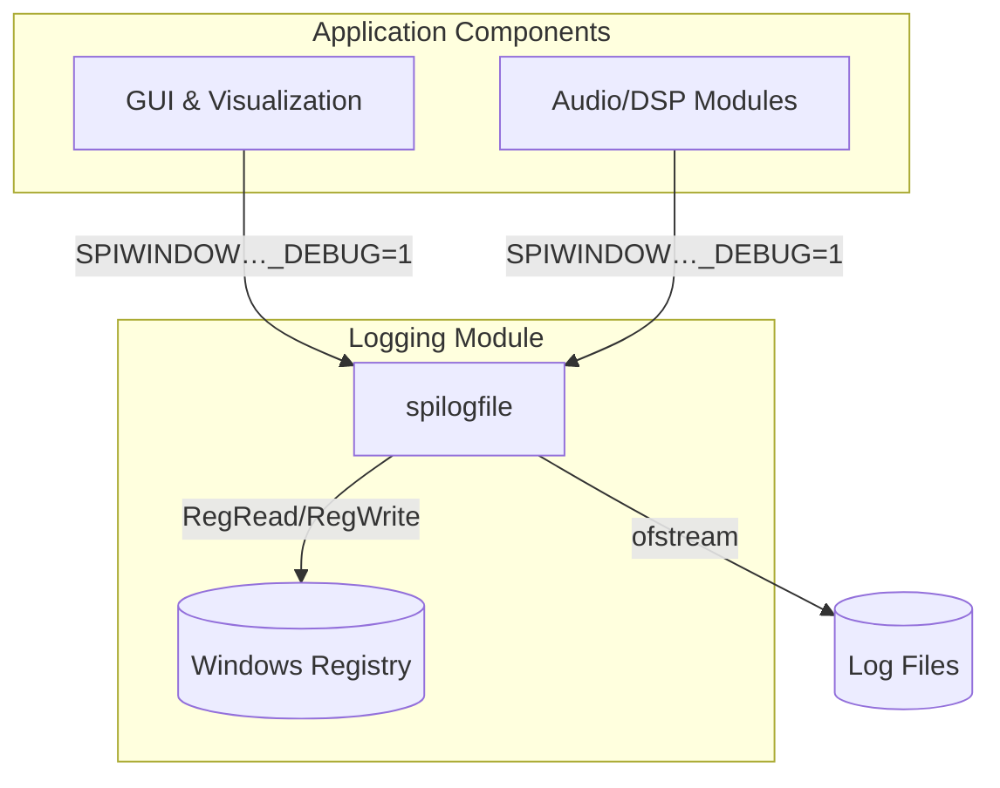
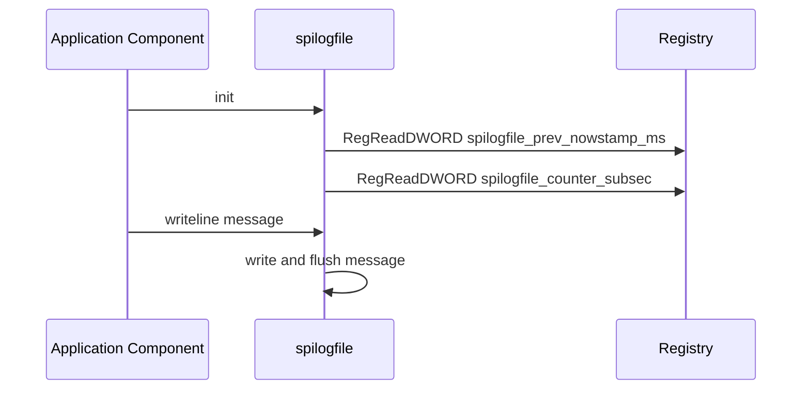

# Logging and Registry-Backed Counters (spilogfile) Feature Documentation

## Overview

The `spilogfile` utility provides lightweight file-based logging with guaranteed unique, timestamped filenames and persistent sub-second counters across application runs. It reads and writes two DWORD values—`prev_nowstamp_ms` and `counter_subsec`—to the Windows registry under the `HKEY_CURRENT_USER\SOFTWARE\audiospi.com\spiwtmvst_vs2017` key. By persisting these values, successive log files created within the same second carry a sub-second suffix to avoid name collisions. Many GUI and DSP visualization components instantiate `spilogfile` when their respective debug macros are enabled, capturing detailed runtime diagnostics.

## Architecture Overview



## Component Structure

### 1. Logging Module

#### **spilogfile** (`spiutility.h` / `spiutility.cpp`)

- **Purpose and responsibilities**

Provides:

- Persistent sub-second counters via registry reads/writes
- Timestamped filename generation
- Message and line-based logging with immediate flush

- **Key Properties**

| Property | Type | Description |
| --- | --- | --- |
| prev_nowstamp_ms | DWORD | Last tick count (ms) read from registry on `init()` |
| counter_subsec | DWORD | Incremented when logs occur within the same second |
| ofs | std::ofstream | Open output stream for writing log entries |


- **Constructors & Destructor**

| Signature | Description |
| --- | --- |
| spilogfile() | Calls `init()`, opens `"log.txt"` for writing |
| spilogfile(string filename, bool timestamped) | Calls `init()`, prefixes `filename` with timestamp if `timestamped==true` and opens it |
| ~spilogfile() | Closes `ofs` if open |


- **Methods**

| Method | Description |
| --- | --- |
| init() → bool | Reads `prev_nowstamp_ms` and `counter_subsec` from registry – always returns `true` |
| write(string mystring, bool to_cout=false) → bool | Writes `mystring` (no newline) to file, flushes, optionally `std::cout` |
| writeline(string mystring, bool to_cout=false) → bool | Appends newline to `mystring` and calls `write(...)` |
| getcurrentdatetime(int format) → string | Formats current date/time; if `format==SUBSEC`, updates/increments `counter_subsec` and `prev_nowstamp_ms` in registry |


### 2. Registry Interaction

#### **Registry Keys & Persistence**

- **Root hive:**

`SPIWINDOWTRANSPARENTMIDIVOROGUISPECTRUMTIMEFRAME_VS2017_HKEYROOT` = `HKEY_CURRENT_USER`

- **Subkey path:**

`SPIWINDOWTRANSPARENTMIDIVOROGUISPECTRUMTIMEFRAME_VS2017_REGSUBKEY` = `L"SOFTWARE\\audiospi.com\\spiwtmvst_vs2017"`

- **Value names persisted by **`**spilogfile**`

| Registry Value | Purpose |
| --- | --- |
| `spilogfile_prev_nowstamp_ms` | Last call’s `GetTickCount()` (ms) |
| `spilogfile_counter_subsec` | Sub-second sequence counter for unique filenames |


### 3. Timestamped Filename Generation

When the `timestamped` constructor parameter is `true`, `spilogfile`:

1. Calls `getcurrentdatetime(GETCURRENTDATETIME_YYYYMMDD_HHMMSS_SUBSEC_NODASHNODOTNOSEMICOLON)`
2. Appends `'_'` and the base `filename`
3. Opens the resulting filename—e.g.

```plaintext
   2021Feb16_164917_002_cvorogui_debug.txt
```

This ensures that multiple debug files created within the same second receive distinct `_000`, `_001`, … suffixes.

## Feature Flows

### Sequence: Logging Initialization and Write



## Enabling & Interpreting Debug Logs

- **Compile-time macros** in `spiwindowtransparentmidivoroguispectrumtimeframe.h` control logging per module:

```cpp
  #define SPIWINDOWTRANSPARENTMIDIVOROGUISPECTRUMTIMEFRAME_VS2017_SPIVOROGUIWINDOW_DEBUG 0
  // … other DEBUG flags …
```

- **Example instantiation** in `spivorogui::Init()`:

```cpp
  p_spilogfile = NULL;
  if (SPIWINDOWTRANSPARENTMIDIVOROGUISPECTRUMTIMEFRAME_VS2017_SPIVOROGUIWINDOW_DEBUG)
      p_spilogfile = DBG_NEW spilogfile("cvorogui_debug.txt", true);
```

- **Runtime interpretation**

Each debug-enabled component writes human-readable lines to its log file; the timestamped filename identifies the run, and line order preserves call sequence.

## Key Classes Reference

| Class | Location | Responsibility |
| --- | --- | --- |
| spilogfile | `spiutility.h` / `spiutility.cpp` | Persistent, timestamped logging with registry-backed sub-second counters |


## Error Handling

- `init()`, `write()`, and `writeline()` return `false` on empty input or I/O failure.
- Registry read/write errors are printed to `std::cout` by the underlying `spiregreadwrite` helpers.

## Caching Strategy

Not applicable for this feature. The registry serves only as simple persistent storage.

## Dependencies

- `<fstream>` for file I/O
- Windows API: `GetTickCount()`, registry functions (`RegReadDWORD`, `RegWriteDWORD`)

## Testing Considerations

- Verify that two sequential calls within the same second produce incremented `_000`, `_001`, … suffixes.
- Confirm that registry values under `HKEY_CURRENT_USER\SOFTWARE\audiospi.com\spiwtmvst_vs2017` update correctly.
- Test component instantiation with debug macros toggled on/off.