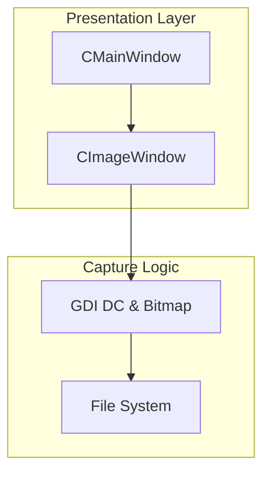
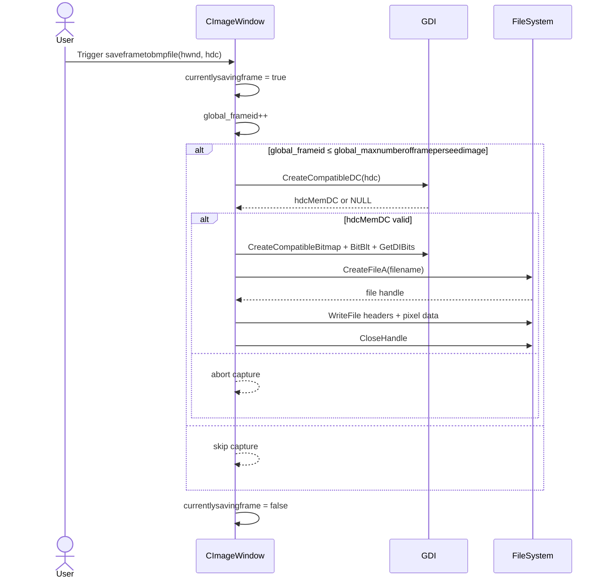

# Batch Frame Capture Feature Documentation

## Overview

The Batch Frame Capture feature automates the saving of visual frames displayed in the Image window to disk as BMP files. When enabled, each repaint of the Image window triggers a call to `CImageWindow::saveframetobmpfile`, which captures the window’s client area via GDI, writes the pixel data to a BMP file, and increments a global frame counter. This enables offline generation of frame sequences for post-processing into video or image sequences.

This capability is core to the frames-batch tool: it allows users to run long, unattended visualizations and have every frame recorded without manual intervention. The captured BMPs can later be converted to JPEG sequences or assembled into an MP4 via FFmpeg.

## Architecture Overview

## Component Structure

### 1. Presentation Layer

#### **CImageWindow** (CImageWindow.h / CImageWindow.cpp)

- **Purpose and responsibilities**

Manages display of seed images in a Win32 GUI window and handles automated batch frame capture when `skipsaveframes` is disabled.

- **Key Properties**
- `string global_outputfoldername` – output directory for BMP frames
- `string global_framefilenameprefix` – filename prefix, e.g. `"frame_"`
- `string global_framefilenameext` – file extension, typically `"bmp"`
- `int global_frameid` – current frame counter
- `int global_maxnumberofframeperseedimage` – maximum frames to capture per seed image
- `bool currentlysavingframe` – flag indicating an in-progress capture
- `bool skipsaveframes` – when true, capture is bypassed

- **Key Methods**
- `void saveframetobmpfile(HWND hwnd, HDC hdc)` – captures and writes a BMP file for the current frame

### 2. Business & Data Access Layers

There are no separate business-logic or HTTP/data-access layers for this feature. Frame capture is implemented entirely within the Image window class using GDI and Win32 file APIs.

## Feature Flows

### 3.1 Capturing frames to BMP from the Image window

This flow shows the decision point where frame capture stops once `global_frameid` exceeds `global_maxnumberofframeperseedimage` .

## State Management

- **global_frameid**: increments each capture; when it exceeds **global_maxnumberofframeperseedimage**, `saveframetobmpfile` returns without writing.
- **currentlysavingframe**: guards against re-entrant captures; set to true at entry and false on every exit path.
- **skipsaveframes**: when true (default), the call to `saveframetobmpfile` is bypassed entirely in `UpdateDisplay`.

## Integration Points

- **CMainWindow (WM_KEYDOWN)** toggles `skipsaveframes` on the Image window and invokes a one-off capture on key `'1'` .
- Captured BMPs are later consumed by the post-processing step in the application (e.g., FFmpeg system calls), but that occurs outside this section.

## Error Handling

`saveframetobmpfile` checks for GDI/DC creation failures:

- If `CreateCompatibleDC` returns NULL, it resets `currentlysavingframe` and returns immediately.
- If `CreateCompatibleBitmap` fails, it deletes the DC, resets the flag, and returns.
- If `BitBlt` fails, it restores the old bitmap, deletes GDI objects, resets the flag, and returns.

Each failure path ensures no orphaned GDI objects remain and the capturing state is cleared .

## Dependencies

- **Win32 GDI**: `CreateCompatibleDC`, `CreateCompatibleBitmap`, `BitBlt`, `GetDIBits`
- **Win32 File I/O**: `CreateFileA`, `WriteFile`, `CloseHandle`
- **CRT & Heap**: `GlobalAlloc`, `GlobalLock`, `GlobalUnlock`, `GlobalFree`

## Key Classes Reference

| Class | Location | Responsibility |
| --- | --- | --- |
| CImageWindow | CImageWindow.h / CImageWindow.cpp | Displays images and implements GDI-based frame capture |

## Testing Considerations

- Verify that BMP files appear in `global_outputfoldername` with names like `frame_000001.bmp`, `frame_000002.bmp`, …
- Confirm that capturing halts after `global_maxnumberofframeperseedimage` frames.
- Simulate failures (e.g., insufficient heap for `GlobalAlloc`) to ensure error paths clear GDI objects and flags correctly.