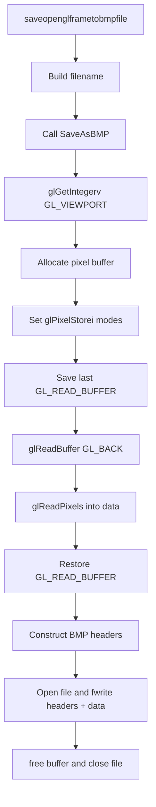

## 3.2 Capturing frames to BMP from the Timeframe window (OpenGL capture)

### Overview

The Timeframe window renders audio-driven visualizations using OpenGL. To support automated batch frame capture, the method `CTimeframeWindow::saveopenglframetobmpfile()` invokes an OpenGL readback path that captures the current back-buffer contents and writes them out as a 24-bit BMP. This approach preserves the full fidelity of the GPU-accelerated visualization (spectrograms, waveforms, autocorrelation plots) and avoids the overhead of GDI bit-blits.

---

### 3.2.1 saveopenglframetobmpfile()

Located in `CTimeframeWindow.cpp`, this method is the entry point for each frame capture:

```cpp
void CTimeframeWindow::saveopenglframetobmpfile()
{
    currentlysavingframe = true;
    global_frameid++;

    if (global_frameid <= global_maxnumberofframeperseedimage)
    {
        // Build zero-padded filename: <outputFolder>\frame_000123.bmp
        string filename = global_outputfoldername + "\\frame_";
        char buf[256];
        sprintf(buf, "%06d", global_frameid);
        filename += buf;
        filename += ".bmp";

        // Delegate to the OpenGL capture routine
        SaveAsBMP(filename.c_str());
        currentlysavingframe = false;
    }
    // ... post-processing into JPEG/MP4 happens elsewhere
}
```

Responsibilities:

- Increment the global frame counter
- Construct a consistent, zero-padded filename
- Call `SaveAsBMP()` to grab back-buffer pixels and write the BMP

---

### 3.2.2 SaveAsBMP()

Also defined in `CTimeframeWindow.cpp`, this routine encapsulates all OpenGL pixel readback and BMP file construction:

```cpp
#define GL_BGR      0x80E0

void CTimeframeWindow::SaveAsBMP(const char *fileName)
{
    // 1. Query viewport dimensions
    GLint viewPort[4];
    glGetIntegerv(GL_VIEWPORT, viewPort);
    int width  = viewPort[2];
    int height = viewPort[3];

    // 2. Compute imageSize with 4-byte row alignment
    unsigned long rowStride    = width * 3;
    unsigned long padding      = (4 - (rowStride % 4)) % 4;
    unsigned long imageSize    = (rowStride + padding) * height;

    // 3. Allocate pixel buffer
    GLbyte *data = (GLbyte*)malloc(imageSize);

    // 4. Set up pixel store modes
    glPixelStorei(GL_PACK_ALIGNMENT,     4);
    glPixelStorei(GL_PACK_ROW_LENGTH,    0);
    glPixelStorei(GL_PACK_SKIP_ROWS,     0);
    glPixelStorei(GL_PACK_SKIP_PIXELS,   0);
    glPixelStorei(GL_PACK_SWAP_BYTES,    1);

    // 5. Preserve current read buffer
    GLenum lastBuffer;
    glGetIntegerv(GL_READ_BUFFER, (GLint*)&lastBuffer);

    // 6. WINDOWS 10 BLACK-FRAME FIX
    //    Ensure we read from the back color buffer, not the front
    glReadBuffer(GL_BACK);

    // 7. Read BGR pixels from (0,0) up to (width,height)
    glReadPixels(0, 0, width, height, GL_BGR, GL_UNSIGNED_BYTE, data);

    // 8. Restore original read buffer
    glReadBuffer(lastBuffer);

    // 9. Prepare BMP headers
    BITMAPFILEHEADER bmfh = {0};
    BITMAPINFOHEADER bmih = {0};

    bmfh.bfType      = 0x4D42;                 // 'BM'
    bmfh.bfOffBits   = sizeof(bmfh) + sizeof(bmih);
    bmfh.bfSize      = bmfh.bfOffBits + imageSize;

    bmih.biSize      = sizeof(bmih);
    bmih.biWidth     = width;
    bmih.biHeight    = height;
    bmih.biPlanes    = 1;
    bmih.biBitCount  = 24;
    bmih.biCompression = BI_RGB;
    bmih.biSizeImage = imageSize;

    // 10. Write headers + pixel data to disk
    FILE *file = fopen(fileName, "wb");
    fwrite(&bmfh, sizeof(bmfh), 1, file);
    fwrite(&bmih, sizeof(bmih), 1, file);
    fwrite(data, 1, imageSize, file);
    fclose(file);

    // 11. Clean up
    free(data);
}
```

Key steps in `SaveAsBMP()`:

- **Viewport query**: determines capture dimensions (`glGetIntegerv(GL_VIEWPORT, …)`)
- **Alignment**: enforces 4-byte row alignment for BMP scanlines
- **Pixel-store modes**: configured so rows map contiguously in memory
- **Black-frame fix**: switches `glReadBuffer` to `GL_BACK` on Windows 10 to avoid empty (black) captures
- **Pixel read**: captures BGR data via `glReadPixels`
- **BMP headers**: constructs `BITMAPFILEHEADER` and `BITMAPINFOHEADER` with correct offsets and sizes
- **File I/O**: opens, writes, and closes the `.bmp` file

---

### 3.2.3 Windows 10 Black-Frame Fix

On Windows 10 the default front-buffer readback (`GL_FRONT`) often yields blank or black frames immediately after GPU presentation. Switching to the back buffer ensures the just-rendered image is still resident and correctly read:

```cpp
// Before fix: glReadBuffer(GL_FRONT);
// After fix for Windows 10:
glReadBuffer(GL_BACK);
```

This single-line change (added on 2021-09-26) restored proper frame captures without visible artifacts.

---

### Capture Flowchart



This diagram illustrates the hand-off from the Timeframe window’s batch logic into the OpenGL pixel-readback routine, culminating in a standalone BMP file for each captured frame.