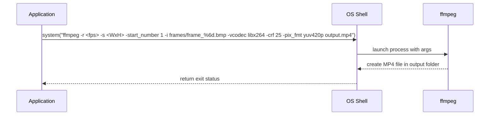

# 4. Post-processing: Frames → MP4 Video + JPG Sequence (and cleanup)

## 4.1 MP4 Generation with ffmpeg (command-line built and executed)

### Overview

After capturing a batch of BMP frames, the application uses a single ffmpeg invocation—assembled at runtime—to transcode those frames into an H.264-encoded MP4 file. Two variants are supported:

- **Voronoi animation** (`_vorotrans-anim`) generated by the **CTimeframeWindow**.
- **Image shuffle** (`_img-shuffle(nx…-ny…)`) generated by the **CVoroguiWindow** (and similarly in CImageWindow).

This step ensures high-quality video output with consistent frame rate and resolution, leveraging ffmpeg’s libx264 encoder.

### Command Assembly

Both variants follow the same template:

- **ffmpeg executable path**: `global_ffmpegpath`
- **Frame rate** (`-r`): clamped to the range 1–60 fps
- **Frame size** (`-s`): set to the canvas dimensions
- **Start number** (`-start_number 1`): ensures numbering begins at `frame_000001.bmp`
- **Input pattern** (`-i …\frame_%6d.bmp`): six-digit, zero-padded
- **Video codec** (`-vcodec libx264`)
- **Quality** (`-crf 25`)
- **Pixel format** (`-pix_fmt yuv420p`)
- **Output file**: constructed per variant

### 4.1.1 Voronoi Animation (`_vorotrans-anim`)

In **CTimeframeWindow::saveopenglframetobmpfile**, once `global_frameid` exceeds the per-seed maximum, the MP4 command is built and executed :

```cpp
// 1) Build output filename
string videocutpath =
    global_outputvideofoldername + "\\" +
    base_seedimagefilename_noext +
    "_vorotrans-anim." +
    global_outputvideofilenameext;

// 2) Clamp fps to [1,60]
char bufferfps[64];
int integerfps = (int)global_outputvideoframepersecond;
if (integerfps < 1)  integerfps = 1;
if (integerfps > 60) integerfps = 60;
sprintf(bufferfps, "%d", integerfps);

// 3) Set video resolution from capture size
char bufferscale[64];
sprintf(bufferscale, "%dx%d", _xwidth, _yheight);

// 4) Resolve absolute path to frames folder
char absolutepath[_MAX_PATH];
_fullpath(absolutepath, global_outputfoldername.c_str(), _MAX_PATH);

// 5) Assemble ffmpeg command
string systemcommand =
    global_ffmpegpath +
    " -r "            + bufferfps +
    " -s "            + bufferscale +
    " -start_number 1" +
    " -i "            + absolutepath + "\\" +
                         global_framefilenameprefix +
                         "%6d." + global_framefilenameext +
    " -vcodec libx264 -crf 25 -pix_fmt yuv420p " +
    videocutpath;

// 6) (Optional) Log for debugging
FILE* pFILE1 = fopen("commands.txt", "w");
if (pFILE1) {
    fprintf(pFILE1, "%s\n", systemcommand.c_str());
    fclose(pFILE1);
}

// 7) Execute
system(systemcommand.c_str());
```

### 4.1.2 Image Shuffle (`_img-shuffle(nx…-ny…)`)

In **CVoroguiWindow::saveframetobmpfile** (and identically in CImageWindow), after all frames are saved, the command uses an `(nx…-ny…)` suffix to reflect grid dimensions :

```cpp
// 1) Create output folder
_mkdir(global_outputvideofoldername.c_str());

// 2) Build "(nx…-ny…)" string
char nxbyny[64];
int nx = (int)getParameterValue("img_nx");
int ny = (int)getParameterValue("img_ny");
sprintf(nxbyny, "(nx%d-ny%d)", nx, ny);

// 3) Build output filename
string videocutpath =
    global_outputvideofoldername + "\\" +
    base_seedimagefilename_noext +
    "_img-shuffle" + nxbyny + "." +
    global_outputvideofilenameext;

// 4) Clamp fps
char bufferfps[64];
int integerfps = (int)global_outputvideoframepersecond;
if (integerfps < 1)  integerfps = 1;
if (integerfps > 60) integerfps = 60;
sprintf(bufferfps, "%d", integerfps);

// 5) Set scale to canvas resolution
char bufferscale[64];
sprintf(bufferscale, "%dx%d", _WIDTH, _HEIGHT);

// 6) Resolve absolute frames path
char absolutepath[_MAX_PATH];
_fullpath(absolutepath, global_outputfoldername.c_str(), _MAX_PATH);

// 7) Assemble and execute ffmpeg
string systemcommand =
    global_ffmpegpath +
    " -r "            + bufferfps +
    " -s "            + bufferscale +
    " -start_number 1" +
    " -i "            + absolutepath + "\\" +
                         global_framefilenameprefix +
                         "%6d." + global_framefilenameext +
    " -vcodec libx264 -crf 25 -pix_fmt yuv420p " +
    videocutpath;

// (Optional) Write command to commands.txt
FILE* pFILE1 = fopen("commands.txt", "w");
if (pFILE1) {
    fprintf(pFILE1, "%s\n", systemcommand.c_str());
    fclose(pFILE1);
}

// Execute
system(systemcommand.c_str());
```

### 4.1.3 Execution Flow



### Key Classes Reference

| Class | Location | Responsibility |
| --- | --- | --- |
| CTimeframeWindow | CTimeframeWindow.cpp | Captures OpenGL frames, assembles and executes ffmpeg for Voronoi animation (`_vorotrans-anim`). |
| CVoroguiWindow | CVoroguiWindow.cpp | Assembles and executes ffmpeg for image-shuffle sequences (`_img-shuffle`). |
