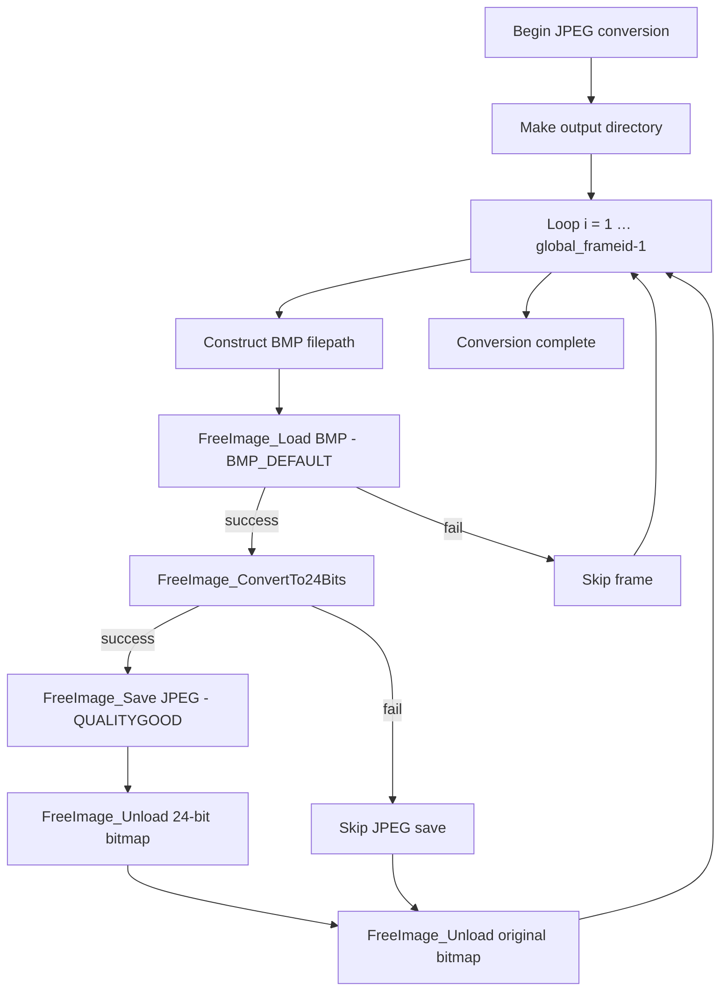

### 4.2 JPG Sequence Conversion using FreeImage (BMP → 24-bit → JPEG)

#### Overview

After generating the MP4 video (section 4.1), the application converts each captured BMP frame into a high-quality JPEG. This creates a per-seed subfolder of JPEGs suitable for archiving, manual review, or downstream processing.

#### Directory Setup

A target folder is created under `global_outputvideofoldername`, named by appending the seed image base name and layout parameters `(nx…-ny…)`. For example:

```cpp
string fullpath =
    global_outputvideofoldername
  + "\\" + base_seedimagefilename_noext
  + "_img-shuffle" + nxbyny;
_mkdir(fullpath.c_str());
```

#### Conversion Workflow



#### Detailed Code Walkthrough

The core loop, found in `CImageWindow.cpp` (and mirrored in `CTimeframeWindow.cpp`), performs the following steps for each frame index:

```cpp
for (int i = 1; i < global_frameid; i++) {
    // 1) Build source BMP path
    string bmp_filepath = global_outputfoldername + "\\";
    char buf[256];
    sprintf(buf, "%06d", i);
    string filename = "frame_" + string(buf);
    bmp_filepath += filename + ".bmp";

    // 2) Load BMP into FreeImage
    FIBITMAP* myFIBITMAP =
        FreeImage_Load(FIF_BMP, bmp_filepath.c_str(), BMP_DEFAULT);
    if (myFIBITMAP) {
        // 3) Build destination JPEG path
        string jpg_filepath = fullpath + "\\" + filename + ".jpg";

        // 4) Convert BMP to 24-bit RGB
        FIBITMAP* my24bitFIBITMAP =
            FreeImage_ConvertTo24Bits(myFIBITMAP);
        if (my24bitFIBITMAP) {
            // 5) Save as JPEG with GOOD quality
            BOOL bresult = FreeImage_Save(
                FIF_JPEG,
                my24bitFIBITMAP,
                jpg_filepath.c_str(),
                JPEG_QUALITYGOOD
            );
            FreeImage_Unload(my24bitFIBITMAP);
        }
        // 6) Unload original BMP bitmap
        FreeImage_Unload(myFIBITMAP);
    }
}
```

This loop gracefully skips any frames that fail to load or convert, ensuring the batch process continues uninterrupted .