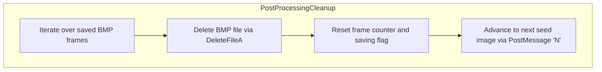
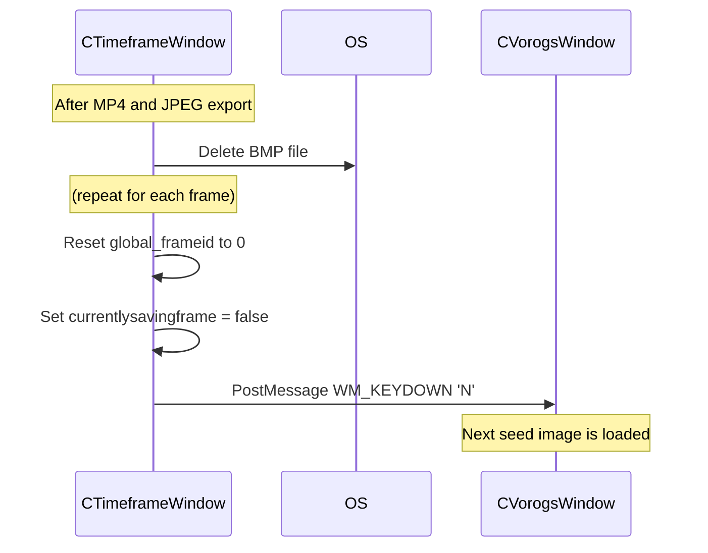

# 4.3 Cleanup and Batch Continuation

## Overview

Once MP4 generation (via `ffmpeg`) and JPEG sequence export (via FreeImage) complete, the application enters a cleanup phase. In this phase, all intermediate BMP files are deleted to reclaim disk space, global counters are reset so the next batch can start from frame 1, and the workflow advances automatically to the next seed image. This ensures fully automated batch processing of multiple input images without manual intervention.

## Architecture Overview



## Component Structure

### CTimeframeWindow – saveopenglframetobmpfile (CTimeframeWindow.cpp)

- **Purpose and responsibilities**

After exporting an OpenGL-rendered timeframe sequence to MP4 and JPEG, this method deletes the on-disk BMP frames, resets global state, and triggers loading of the next seed image.

- **Key Steps**
- Loop from `i = 1` to `global_frameid - 1` and call `DeleteFileA` on each `"frames\frame_%06d.bmp"` path.
- Set `global_frameid = 0`.
- Set `currentlysavingframe = false`.
- Post an `'N'` keydown message to the Vorogs window (`global_pVorogsWindow`) to advance the seed image.

- **Relevant code**

```cpp
  for (int i = 1; i < global_frameid; i++)
  {
      string bmp_filepath = global_outputfoldername + "\\" + global_framefilenameprefix;
      char buf[256];
      sprintf(buf, "%06d", i);
      bmp_filepath += buf;
      bmp_filepath += ".bmp";

      // delete intermediate BMP
      DeleteFileA(bmp_filepath.c_str());
  }

  // reset for next batch
  global_frameid = 0;
  currentlysavingframe = false;

  // advance to next seed image
  PostMessage(global_pVorogsWindow->GetHWND(), WM_KEYDOWN, LOWORD('N'), 0);
```

### CImageWindow – saveframetobmpfile (CImageWindow.cpp)

- **Purpose and responsibilities**

Mirrors the cleanup logic for image-shuffle batches: after MP4 and JPEG outputs, it removes BMP frames, resets counters, clears the saving flag, and posts the next-image command.

- **Key Steps**
- Iterate through each saved BMP (`frame_000001.bmp`…`frame_%06d.bmp`) and invoke `DeleteFileA`.
- Reset `global_frameid` to 0.
- Set `currentlysavingframe` to `false`.
- Post an `'N'` keydown (`WM_KEYDOWN`) to `global_pVorogsWindow`.

- **Relevant code**

```cpp
  for (int i = 1; i < global_frameid; i++)
  {
      string bmp_filepath = global_outputfoldername + "\\" + global_framefilenameprefix;
      char buf[256];
      sprintf(buf, "%06d", i);
      bmp_filepath += buf;
      bmp_filepath += ".bmp";

      // delete BMP
      DeleteFileA(bmp_filepath.c_str());
  }

  // reset for next batch
  global_frameid = 0;
  currentlysavingframe = false;

  // advance seed image
  PostMessage(global_pVorogsWindow->GetHWND(), WM_KEYDOWN, LOWORD('N'), 0);
  return;
```

## Feature Flow

### Sequence Diagram: Cleanup and Batch Continuation



## Key Classes Reference

| Class | Location | Responsibility |
| --- | --- | --- |
| CTimeframeWindow | CTimeframeWindow.cpp | Manages OpenGL timeframe rendering, post-processing cleanup and automatic seed-image advancement. |
| CImageWindow | CImageWindow.cpp | Handles image-shuffle rendering, BMP→JPEG conversion, cleanup and batch continuation. |
