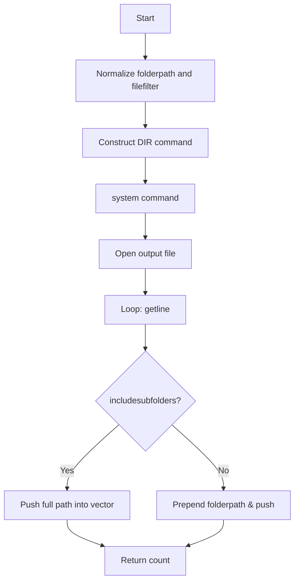

# 5. Seed Images & Slideshow Inputs (batch across multiple images)

## 5.1 Building an image list from a folder (DIR-based filename discovery)

### Overview

To automate batch frame capture across multiple seed images, the application first needs to discover all image files in one or more folders. The helper function `getfilenamesfromfolder` shells out to the Windows `DIR` command (with an optional `/S` flag for recursion), redirects its output to a text file, then reads that file back into a `std::vector<std::string>` for use by the slideshow/visualizer components. This approach leverages the OS filesystem indexing for fast file enumeration and keeps external dependencies to a minimum.

### Helper Function

#### getfilenamesfromfolder

Declared in **spiutility.h**

Signature and comments:

```cpp
// Uses DIR command to populate all found filenames into supplied txt file and supplied string vector
// Searches for files matching supplied filter in supplied directory, including all subfolders by default
// Returns files count
int getfilenamesfromfolder(
    std::string folderpath,
    std::string filefilter,
    std::string outputtxtfilename,
    vector<std::string> &outputstringvector,
    bool includesubfolders = true
);
```

##### Purpose

- Build a list of matching filenames (e.g. `*.jpg`, `*.bmp`) from a given folder.
- Optionally recurse into all subdirectories.
- Persist the raw `DIR` output to a text file for debugging or reuse.
- Populate a C++ vector with each filepath.

### Parameters

| Parameter | Type | Description |
| --- | --- | --- |
| `folderpath` | `std::string` | Path to the directory to search (e.g. `"C:\\Images"`). |
| `filefilter` | `std::string` | Wildcard file pattern (e.g. `"*.jpg"` or `"*.bmp"`). |
| `outputtxtfilename` | `std::string` | Name of the file to which the raw `DIR` output is redirected (e.g. `"filelist.txt"`). |
| `outputstringvector` | `vector<string>&` | Vector that will be filled with the discovered file paths. |
| `includesubfolders` | `bool` (default `true`) | If `true`, adds `/S` to the `DIR` command to recurse into subdirectories; otherwise top-level only. |


### Execution Flow



### Implementation Details

1. **Path-filter construction**
2. If `folderpath` ends with `"\\"`, `pathfilter = folderpath + filefilter`; otherwise `pathfilter = folderpath + "\\" + filefilter`.
3. **Command assembly**
4. Surround `pathfilter` with quotes.
5. Use `/B` for bare output, `/O:N` for name sorting.
6. Add `/S` if `includesubfolders` is `true`.
7. Redirect output to `outputtxtfilename`.
8. **Execution**

```cpp
   string quote = "\"";
   string subfolderflag = includesubfolders ? "/S " : "";
   string systemcommand =
       "DIR " + quote + pathfilter + quote +
       "/B " + subfolderflag +
       "/O:N > " + outputtxtfilename;
   system(systemcommand.c_str());
```

1. **Reading results**

```cpp
   ifstream ifs(outputtxtfilename);
   string temp;
   while (getline(ifs, temp)) {
       if (temp.empty()) continue;
       if (includesubfolders) {
           outputstringvector.push_back(temp);
       }
       else {
           string prefix = folderpath;
           if (folderpath.back() != '\\') prefix += "\\";
           outputstringvector.push_back(prefix + temp);
       }
   }
   return outputstringvector.size();
```

### Return Value

Returns the number of file paths successfully added to `outputstringvector`.

### Practical Guidance

- **Folder Path**: Provide an absolute path without trailing wildcards, e.g. `"C:\\Users\\Public\\Pictures"`.
- **File Filter**: Use patterns like `"*.jpg"` to match image types.
- **Output List File**: Choose a descriptive name (`"images.txt"`) so you can inspect or reuse it. The file will be created in the current working directory.
- **Subfolder Control**: Set `includesubfolders=false` for a flat folder scan; set to `true` (default) to include all nested folders.

### Example Usage

```cpp
vector<string> imageList;
int count = getfilenamesfromfolder(
    "C:\\Users\\Public\\Pictures",
    "*.jpg",
    "images.txt",
    imageList,      // populated with full paths
    true            // recurse into subfolders
);
cout << "Found " << count << " images.\n";
```

This list (`imageList`) can then drive the slideshow input for `CVorogsWindow`, `CImageWindow`, or `CTimeframeWindow` to cycle through seed images during batch frame capture.