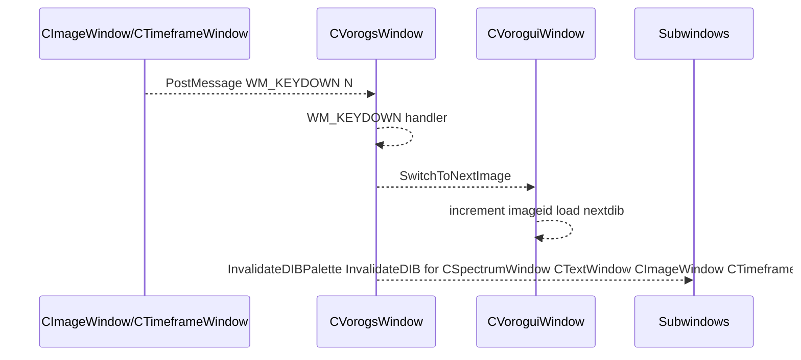

## 5.2 Switching to Next Seed Image during/after Batch Saving

### Overview

After the application finishes saving a batch of frames for the current seed image—either in the image‐shuffle mode (CImageWindow) or the spectrum/timeframe OpenGL mode (CTimeframeWindow)—it automatically advances to the next seed in the slideshow. This transition is orchestrated by posting a synthetic “N” key event to the Vorogs window, which centrally manages seed‐image cycling. The Vorogs window intercepts this event, invokes its `SwitchToNextImage` handler, and propagates the new image to all visualization subwindows (text, image, spectrum, timeframe).

### Sequence Diagram



### 5.2.1 Triggering Advancement after Post-Processing

• **CTimeframeWindow**

In `CTimeframeWindow::saveopenglframetobmpfile`, once all `.bmp` frames have been converted into MP4 via an ffmpeg system call and into JPEGs, the global frame counter is reset and a “next” command is posted to the Vorogs window:

```cpp
  PostMessage(global_pVorogsWindow->GetHWND(), WM_KEYDOWN, LOWORD('N'), 0);
```

• **CImageWindow**

Similarly, in the OpenGL‐based image‐shuffle mode (`CImageWindow::saveframetobmpfile`), after deleting the temporary BMP frames and finalizing post‐processing, the code posts both a character and a key‐down event to advance the seed:

```cpp
  PostMessage(global_pVoroguiWindow->GetHWND(), WM_CHAR, LOWORD('N'), 0);
  PostMessage(global_pVorogsWindow->GetHWND(), WM_KEYDOWN, LOWORD('N'), 0);
```

### 5.2.2 Vorogs Window Key Handler

The Vorogs window intercepts WM_KEYDOWN events in its message router and dispatches the “N” key to `SwitchToNextImage`:

```cpp
case WM_KEYDOWN:
    if (wParam == 'N')
        SwitchToNextImage();
    else
        CVoroguiWindow::wndProc(hwnd, uMsg, wParam, lParam);
    break;
```

This handler lives in `CVorogsWindow::wndProc` and ensures that every “N” advances to the next seed image.

### 5.2.3 SwitchToNextImage Workflow

• **Declaration**

```cpp
  void SwitchToNextImage();
```

in `CVorogsWindow.h`

• **Base‐Class Behavior**

`CVorogsWindow::SwitchToNextImage` first calls its base class, `CVoroguiWindow::SwitchToNextImage`, which:

1. Increments or wraps the internal `_imageid`
2. Loads the next `FIBITMAP*` into `_nextdib`
3. Resets `_dib` so that subsequent draws will use the new image

• **Additional Vorogs-Specific Updates**

After the base behavior, `CVorogsWindow` propagates the new seed image to every parameter window:

```cpp
  // base behavior
  CVoroguiWindow::SwitchToNextImage();

  // propagate to all subwindows
  FIBITMAP* nextQuantized = FreeImage_ColorQuantizeEx(_nextdib);
  // update palette for spectrum display
  CSpectrumWindow* pSpec = /* find in _windowparameterpointers */;
  if (pSpec)
      pSpec->InvalidateDIBPalette(FreeImage_GetPalette(nextQuantized));

  // update text window
  CTextWindow* pText = /* find */;
  if (pText)
      pText->InvalidateDIB(_nextdib);

  // update image window
  CImageWindow* pImg = /* find */;
  if (pImg)
      pImg->InvalidateDIB(_nextdib);

  // update timeframe window with new image index
  CTimeframeWindow* pTF = /* find */;
  if (pTF)
      pTF->InvalidateDIB(_imageid);
```

Together, these steps ensure that each time batch saving completes, the slideshow seamlessly advances to the next seed image, and all visualization windows reflect the new seed without user intervention.