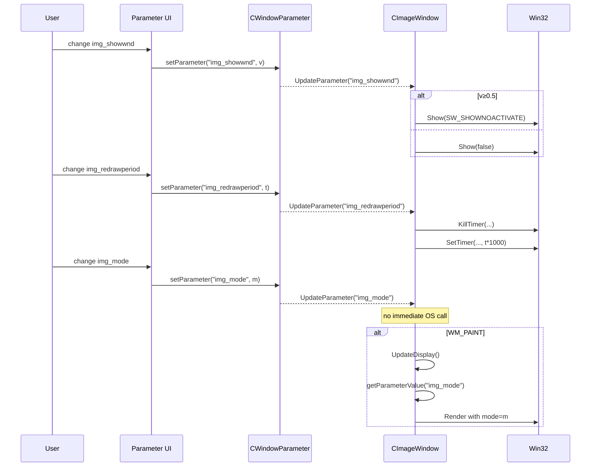

# 6. Visual Modes & Controls (User-Facing Parameters)

## 6.1 Image Shuffle Window Modes & Parameters (img_*)

### Overview

The Image Shuffle window presents a seed image that is repeatedly “shuffled” according to various modes and parameters. Users can tune timing, colorization, blending, randomness, and grid resolution to produce a wide range of visual effects. All parameters carry the prefix `img_` and are registered in the window’s initialization, then applied dynamically via `CImageWindow::UpdateParameter`.

### 6.1.1 Parameter Registration

During construction, `CImageWindow::Initialize` invokes `addParameter` for each user-tunable setting. The table below lists every `img_*` parameter, its type, allowable range, default value, and purpose :

| Parameter | Type | Range | Default | Description |
| --- | --- | --- | --- | --- |
| img_showwnd | Toggle | 0.0 – 1.0 | 1.0 | Show (≥0.5) or hide (<0.5) the Image Shuffle window |
| img_mode | Continuous | 0.0 – 4.0 | 1.0 | Shuffle mode index (cast to `int`) |
| img_redrawperiod | Continuous | 0.050 – 1.0 | 0.050 | Time between redraws, in seconds |
| img_bgcolorid_r | Continuous | 0 – 255 | 0 | Background color red component (byte) |
| img_bgcolorid_g | Continuous | 0 – 255 | 0 | Background color green component |
| img_bgcolorid_b | Continuous | 0 – 255 | 0 | Background color blue component |
| img_idcolorlowest_r | Continuous | 0 – 255 | 64 | Lowest identifier color red component |
| img_idcolorhighest_r | Continuous | 0 – 255 | 96 | Highest identifier color red component |
| img_idcolorlowest_g | Continuous | 0 – 255 | 64 | Lowest identifier color green component |
| img_idcolorhighest_g | Continuous | 0 – 255 | 96 | Highest identifier color green component |
| img_idcolorlowest_b | Continuous | 0 – 255 | 64 | Lowest identifier color blue component |
| img_idcolorhighest_b | Continuous | 0 – 255 | 96 | Highest identifier color blue component |
| img_mixratio | Continuous | 0.0 – 1.0 | 0.5 | Blend ratio between original and shuffled pixels |
| img_att_r | Continuous | 0.0 – 1.0 | 1.0 | Attenuation factor for red channel |
| img_att_g | Continuous | 0.0 – 1.0 | 0.5 | Attenuation factor for green channel |
| img_att_b | Continuous | 0.0 – 1.0 | 1.0 | Attenuation factor for blue channel |
| img_invprob | Continuous | 2.0 – 10.0 | 2.0 | Inverse probability (1/invprob chance) to invert pixel |
| img_nx | Continuous | 1 – 40 | 10 | Number of grid cells along the X axis |
| img_ny | Continuous | 1 – 40 | 10 | Number of grid cells along the Y axis |


### 6.1.2 Applying Parameter Changes

All parameter updates flow through `CWindowParameter::setParameter(name, value)`, which stores the new value and calls the window’s override `UpdateParameter(name)` .

#### img_showwnd

Immediately shows or hides the window without activation:

```cpp
if (name == "img_showwnd") {
    float flag = getParameterValue("img_showwnd");
    if (flag >= 0.5f) Show(SW_SHOWNOACTIVATE);
    else             Show(false);
}
```

#### img_redrawperiod

Resets the update timer to the new interval (in seconds):

```cpp
if (name == "img_redrawperiod" && _hwnd) {
    KillTimer(_hwnd, IMAGEWINDOW_IDTIMER_UPDATEIMAGE);
    float sec = getParameterValue("img_redrawperiod");
    SetTimer(_hwnd, IMAGEWINDOW_IDTIMER_UPDATEIMAGE, sec * 1000, NULL);
}
```

#### Other img_* Parameters

For all other parameters (`img_mode`, color channels, `img_mixratio`, `img_att_*`, `img_invprob`, `img_nx`, `img_ny`), `UpdateParameter` does not take immediate action. Instead, the new values are picked up on the next paint cycle when `CImageWindow::UpdateDisplay` reads them and renders the shuffled image accordingly.

### 6.1.3 Sequence Diagram: Parameter Flow



This completes the documentation of all `img_*` parameters in the Image Shuffle window and describes how changes take effect at runtime.