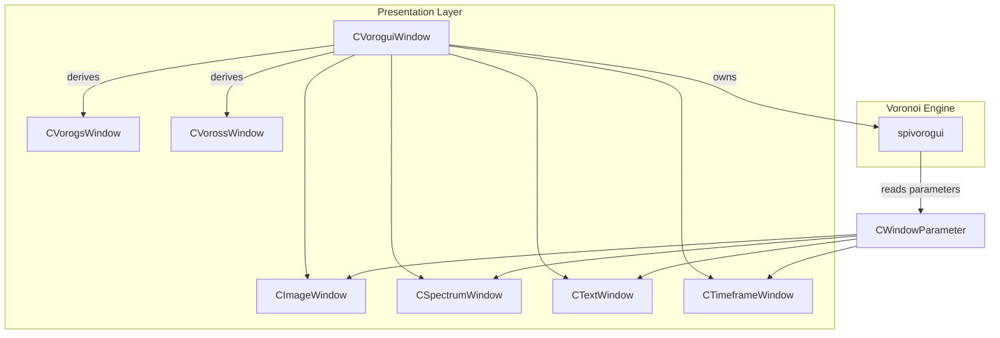
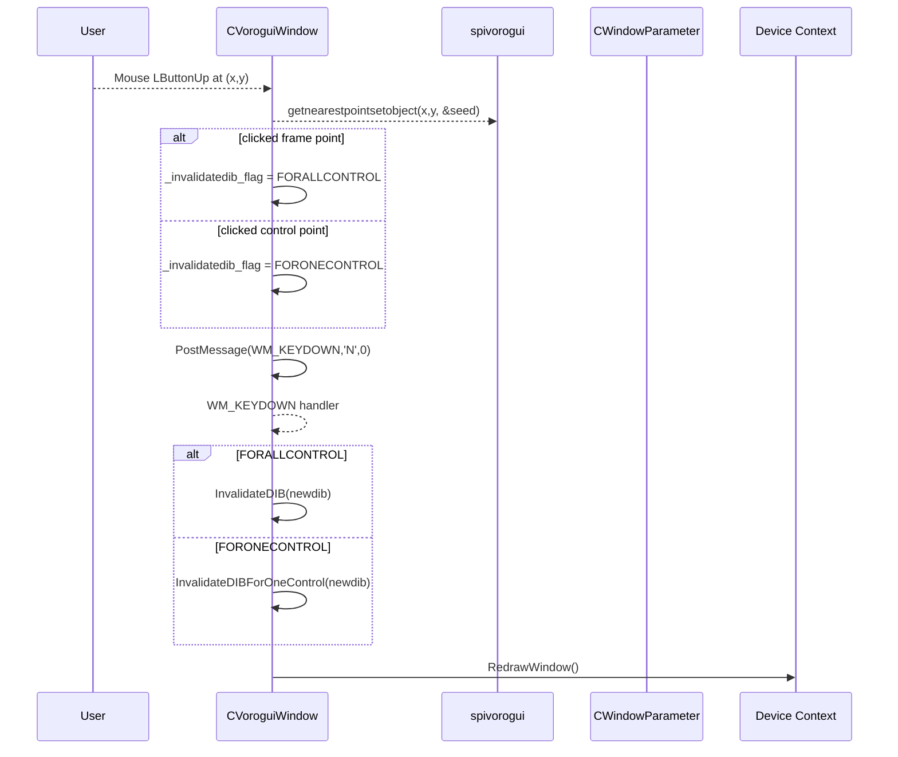
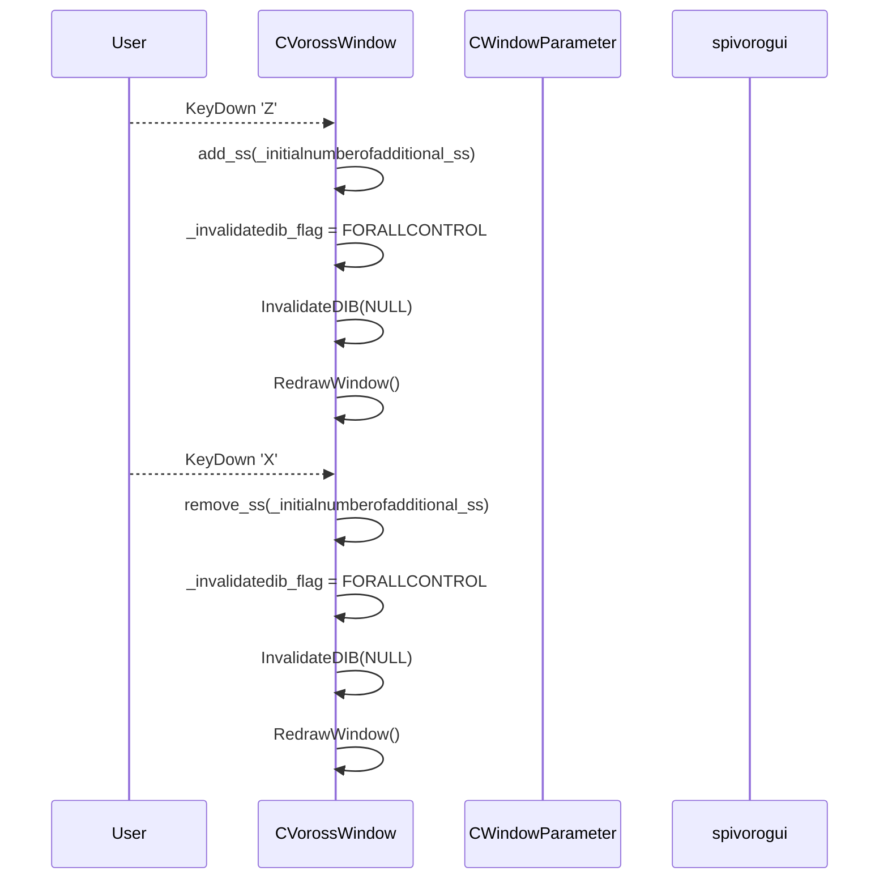

# Voronoi GUI / Slideshow Controls Feature Documentation

## Overview

The Voronoi GUI / Slideshow Controls feature provides users with interactive control over Voronoi-based graphical overlays and automated seed-image slideshows within the desktop application. It enables frame-by-frame navigation (‘N’ key), dynamic invalidation of Voronoi control layers, and fine-grained selection of individual or random control points via mouse interactions.  In slideshow mode, users can add or remove “ssN” toggle parameters in bulk using the ‘Z’ and ‘X’ keys, instantly refreshing the Voronoi layout. This feature ties together the rendering engine (`spivorogui`), window parameter framework, and multiple GUI windows (image, spectrum, text, timeframe), ensuring synchronized updates across all views.

## Architecture Overview

## Component Structure

### Presentation Layer

#### CVoroguiWindow (CVoroguiWindow.h / CVoroguiWindow.cpp)

- **Purpose**

Base class for all Voronoi-driven windows. Manages image sequence, orchestrates invalidation logic, and dispatches redraws to parameter windows.

- **Key Properties**

| Property | Type | Description |
| --- | --- | --- |
| _invalidatedib_flag | int | Current invalidation mode flag |
| _dib, _nextdib, _nextquantizeddib | FIBITMAP* | Current and next frame bitmaps |
| _windowparameterpointers | vector\<CWindowParameter*\> | Linked parameter windows (image, spectrum, text, timeframe) |
| _pVOROGUI | spivorogui* | Voronoi rendering and control engine |

- **Key Methods**

| Method | Description |
| --- | --- |
| Initialize() | Sets up fonts, canvases, timers, and default invalidation flag |
| wndProc(HWND, UINT, WPARAM, LPARAM) | Processes WM_KEYDOWN, WM_LBUTTONUP, WM_PAINT, etc. |
| SwitchToNextImage() | Advances to the next image and notifies all parameter windows |
| InvalidateDIB(FIBITMAP* newdib) | Full invalidation of control layer, reset canvas states |
| InvalidateDIBForOneControl(...) | Invalidate only one control polygon |
| InvalidateDIBForOneRandomControl(...) | Invalidate a single random control polygon |
| InvalidateDIBFor50pcRandomControl(...) | Invalidate 50% of controls at random |

#### CVorossWindow (CVorossWindow.h / CVorossWindow.cpp)

- **Purpose**

Specialized subclass for slideshow mode. Automatically adds “ssN” toggle parameters to seed-image Voronoi layouts.

- **Key Properties**

| Property | Type | Description |
| --- | --- | --- |
| _initialnumberofadditional_ss | int | Number of ss-toggles to add on init |
| _totalnumberofadditional_ss | int | Running count of added ss-toggles |

- **Key Methods**

| Method | Description |
| --- | --- |
| add_ss(int count, bool init=true) | Adds `count` parameters named “ss0…ssN” |
| remove_ss(int count, int index=-1) | Removes the last `count` ss-parameters |
| Initialize(bool firstTime=true) | Pushes itself into `_windowparameterpointers` and calls add_ss on first run |
| wndProc(...) | Handles ‘Z’/’X’ key events to bulk add/remove ss toggles |

#### CVorogsWindow (CVorogsWindow.h / CVorogsWindow.cpp)

- **Purpose**

Static Voronoi surface window. Similar to `CVoroguiWindow` but without slideshow toggles.

- **Key Methods**

| Method | Description |
| --- | --- |
| SwitchToNextImage() | Overrides base to also propagate new frame to all parameter windows |
| wndProc(...) | Handles ‘N’ key for next image and delegates others |

#### spivorogui (spivorogui.h / spivorogui.cpp)

- **Purpose**

Core Voronoi engine that manages point generation, control ratios, polygon slicing, and hit-testing.

- **Key Methods**

| Method | Description |
| --- | --- |
| drawvorogui(HDC &hdc, int idpoint, …) | Renders Voronoi polygons, control levels, and labels |
| getnearestpointsetobject(double x, double y, int* seed) | Returns index of nearest control or frame point |
| onlbuttonup(HWND, WPARAM, LPARAM) | Processes left-button up events for control selection |
| onrbuttonup(HWND, WPARAM, LPARAM) | Processes right-button up events for random control or batch invalidation |
| updatecontrolsfromparameters() | Syncs control ratios from CWindowParameter |

## Feature Flows

### 1. Interactive Selection Flow

- Control hit-testing uses `spivorogui::getnearestpointsetobject` to map click to a Voronoi cell .
- Depending on hit-test result, `_invalidatedib_flag` is set to one of:
- `VOROGUI_INVALIDATEDIB_FORALLCONTROL`
- `VOROGUI_INVALIDATEDIB_FORONECONTROL`
- A synthetic ‘N’ key event triggers the invalidation dispatch, which calls the appropriate InvalidateDIB method .

### 2. Slideshow Controls Flow

- ‘Z’ adds a batch of new `ssN` toggle parameters; ‘X’ removes them, each followed by a full invalidation .

## State Management

### Invalidation Flags

| Flag | Value | Effect |
| --- | --- | --- |
| VOROGUI_INVALIDATEDIB_FORALLCONTROL | 1 | Redraw all control levels and polygons |
| VOROGUI_INVALIDATEDIB_FORONECONTROL | 2 | Redraw only the one control polygon under the mouse click |
| VOROGUI_INVALIDATEDIB_FORONERANDOMCONTROL | 4 | Redraw a single randomly chosen control polygon |
| VOROGUI_INVALIDATEDIB_FOR50PCRANDOMCONTROL | 8 | Redraw 50% of control polygons at random |

## Integration Points

- **CImageWindow**: Receives `InvalidateDIB(_nextdib)` when frames advance.
- **CSpectrumWindow / CSpectrum24bitWindow**: Receive `InvalidateDIBPalette` on quantized frames.
- **CTextWindow**: Updated via `InvalidateDIB` for overlay labels.
- **CTimeframeWindow**: Receives `InvalidateDIB(_imageid)` for audio-driven timelines.

## Testing Considerations

- Verify clicking on different Voronoi regions toggles the correct `_invalidatedib_flag` and only the intended polygons redraw.
- Ensure ‘N’ reliably advances the slideshow and synchronizes all parameter windows.
- Test ‘Z’/’X’ in CVorossWindow to confirm bulk addition/removal of ss-toggles and proper invalidation.
- Stress-test rapid keypresses and clicks for race-condition-free rendering.

## Key Classes Reference

| Class | File | Responsibility |
| --- | --- | --- |
| CVoroguiWindow | CVoroguiWindow.h / CVoroguiWindow.cpp | Base Voronoi GUI window; orchestrates invalidation and image slides |
| CVorossWindow | CVorossWindow.h / CVorossWindow.cpp | Slideshow window; manages bulk ss-toggle parameters |
| CVorogsWindow | CVorogsWindow.h / CVorogsWindow.cpp | Static Voronoi surface window |
| spivorogui | spivorogui.h / spivorogui.cpp | Core Voronoi rendering, control ratios, and hit-testing engine |
| CWindowParameter | CWindowParameter.h / CWindowParameter.cpp | Parameter management base class |
| CImageWindow | CImageWindow.h / CImageWindow.cpp | Displays background images and handles frame saving |
| CSpectrumWindow | CSpectrumWindow.h / CSpectrumWindow.cpp | Real-time audio spectrum visualization |
| CSpectrum24bitWindow | CSpectrum24bitWindow.h / CSpectrum24bitWindow.cpp | 24-bit audio spectrum window |
| CTextWindow | CTextWindow.h / CTextWindow.cpp | Overlays text labels for controls |
| CTimeframeWindow | CTimeframeWindow.h / CTimeframeWindow.cpp | Audio timeframe / waveform visualization |
