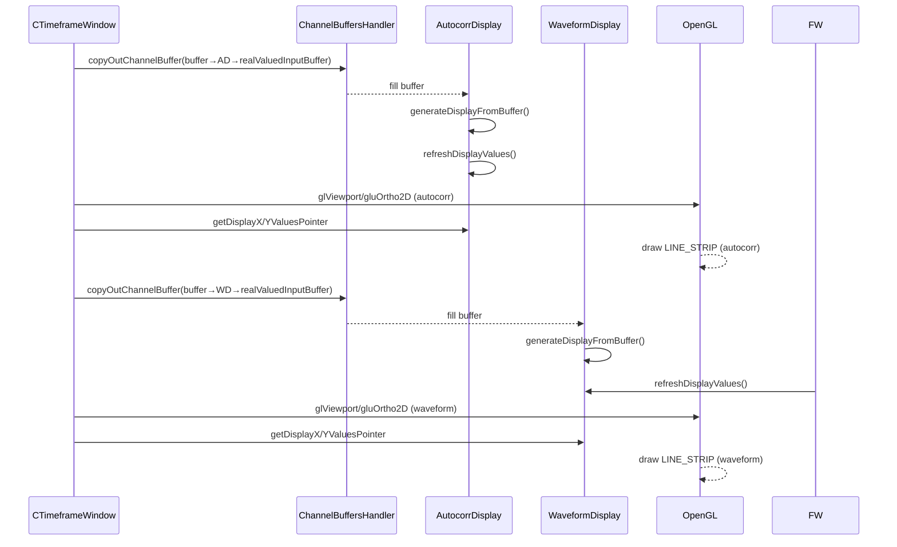

# 7. Audio-driven Visualizations (Spectrum / Waveform / Autocorrelation)

## 7.1 Timeframe Window: What Is Displayed and How It’s Drawn

### Overview

The Timeframe window in the frames-batch application presents synchronized, real-time views of an incoming audio stream in both the correlation and time domains. On the left, it shows the autocorrelation function—revealing periodicities in the signal—while on the right it plots the waveform—depicting amplitude variations over time. These sub-views update continuously by copying audio buffers into display components and rendering them with OpenGL, giving end users immediate visual feedback on audio characteristics.

### Component Structure

- **CTimeframeWindow** (CTimeframeWindow.cpp / .h)

Manages OpenGL context, audio buffer acquisition, and orchestrates sub-view rendering.

- **ChannelBuffersHandler** (ChannelBuffersHandler.cpp / .h)

Splits and mixes stereo audio frames into per-channel sample buffers.

- **AutocorrDisplay** (AutocorrDisplay.cpp / .h)

Computes positive-lag autocorrelation and maps results to 2D display arrays.

- **WaveformDisplay** (WaveformDisplay.cpp / .h)

Maps raw audio samples directly into 2D display arrays.

### Initialization of Display Objects

In `CTimeframeWindow::Initialize`, both displays are constructed with the same sample length (`bufferFrames`) and mapped to a 400×100 viewport, leaving a 10-pixel margin on each side:

```cpp
_waveformDisplayL = DBG_NEW WaveformDisplay(
    bufferFrames,    // N_In: number of samples
    10, 380,         // displayMinX, displayWidth
    10, 80,          // displayMinY, displayHeight
    0, bufferFrames, // minIndex, maxIndex
    -1.0, 1.0        // Y-axis clipping limits
);
_autocorrDisplayL = DBG_NEW AutocorrDisplay(
    bufferFrames, 10, 380, 10, 80,
    0, bufferFrames,
    -8, 8           // lag clipping limits
);
```

### Rendering Workflow

#### 1. Copy Audio into Display Buffers

Each frame, `CTimeframeWindow` pulls the latest left-channel samples into the display buffers:

```cpp
_drawnFromAudioBuffers->copyOutChannelBuffer(
    _autocorrDisplayL->realValuedInputBuffer, 0
);
```

#### 2. Generate Display Data

- **Autocorrelation**

```cpp
  AutocorrDisplay::generateDisplayFromBuffer() {
      autocorr(realValuedInputBuffer, autocorrelationValues);
      refreshDisplayValues();
  }
```

This computes the N-point autocorrelation and updates internal X/Y arrays.

- **Waveform**

```cpp
  WaveformDisplay::generateDisplayFromBuffer() {
      refreshDisplayValues();
  }
```

This simply transfers the raw sample buffer into the display arrays.

#### 3. Draw with OpenGL

Each sub-view uses its own viewport and an orthographic projection:

```cpp
// Autocorrelation window
glViewport(20, 10, 400, 100);
gluOrtho2D(0, 400, 0, 100);
// draw semi-transparent background quad...
const float* xVals = _autocorrDisplayL->getDisplayXValuesPointer();
const float* yVals = _autocorrDisplayL->getDisplayYValuesPointer();
glColor4f(1,1,1,1);
glBegin(GL_LINE_STRIP);
  for (GLint i = 0; i < _autocorrDisplayL->getPlotLength(); i++)
    glVertex2f(*xVals++, *yVals++);
glEnd();

// Waveform window
glViewport(440, 10, 400, 100);
gluOrtho2D(0, 400, 0, 100);
// draw semi-transparent background quad...
_drawnFromAudioBuffers->copyOutChannelBuffer(
    _waveformDisplayL->realValuedInputBuffer, 0
);
_waveformDisplayL->generateDisplayFromBuffer();
xVals = _waveformDisplayL->getDisplayXValuesPointer();
yVals = _waveformDisplayL->getDisplayYValuesPointer();
glColor3f(1,1,1);
glBegin(GL_LINE_STRIP);
  for (GLint i = 0; i < _waveformDisplayL->getPlotLength(); i++)
    glVertex2f(*xVals++, *yVals++);
glEnd();
```

### Rendering Sequence



### Key Classes

| Class | Responsibility |
| --- | --- |
| CTimeframeWindow | Manages audio acquisition, OpenGL setup, and sub-view layout |
| ChannelBuffersHandler | Splits/mixes audio into per-channel buffers |
| AutocorrDisplay | Computes autocorrelation & prepares 2D line data |
| WaveformDisplay | Prepares raw sample 2D line data |


This section describes how the Timeframe window continuously visualizes the autocorrelation and waveform of live audio by copying samples, generating display arrays, and rendering them efficiently with OpenGL.