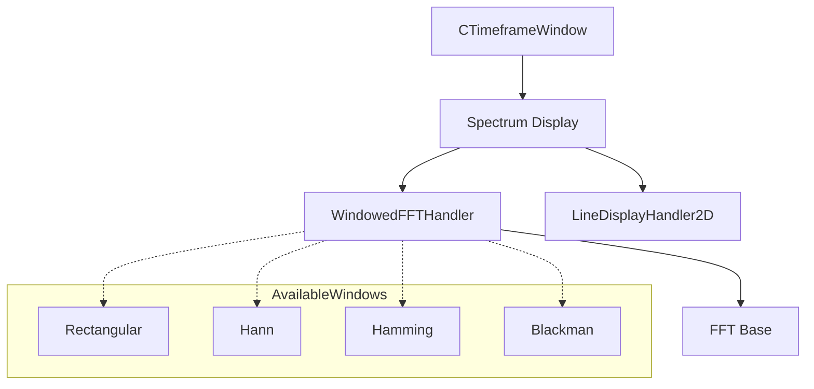

## 7.2 Windowing/FFT Settings that Affect Spectrum Displays

### Overview

The choice of FFT window has a direct impact on the appearance and accuracy of the spectrum display. Different window functions trade off frequency resolution (main-lobe width) against spectral leakage (sidelobe suppression and roll-off). In this application, windowing is managed by the `WindowedFftHandler` class, which underlies the `SpectrumDisplay` used in time-frame and waterfall visualizations.

### Available Window Functions

`WindowedFftHandler` implements four built-in, symmetric, linear-phase windows:

| Window | Approx. Sidelobe Level | Roll-off Rate | Main-lobe Width |
| --- | --- | --- | --- |
| Rectangular | −13 dB | −6 dB/octave | 2 ωₘ |
| Hann | −32 dB | −12 dB/octave | 4 ωₘ₋₂ |
| Hamming | −41 dB | −6 dB/octave | 4 ωₘ |
| Blackman | −58 dB | −18 dB/octave | 6 ωₘ |


*ωₘ refers to the DFT’s bin spacing in radians/sample.*

### Implementation in WindowedFftHandler

#### Window Generation Functions

Each window is generated on demand (allocating `window[N]` if needed) and normalized so that its sum equals one at DC:

```cpp
//Hann / Hanning: ~ -32 dB sidelobes, -12 dB/octave roll-off, 4 ωₘ₋₂ main-lobe
void WindowedFftHandler::setWindowToHann()
{
    if (window == NULL) window = DBG_NEW SAMPLE[N];
    double ω = 2.0 * MY_PI / (N - 1);
    SAMPLE norm = 1.0/(0.5*N - 0.5);
    for (int n=0; n<N; n++)
        window[n] = (SAMPLE)(norm * 0.5 * (1.0 - cos(ω * n)));
}

//Hamming: ~ -41 dB sidelobes, -6 dB/octave roll-off, 4 ωₘ main-lobe
void WindowedFftHandler::setWindowToHamming()
{
    if (window == NULL) window = DBG_NEW SAMPLE[N];
    double ω = 2.0 * MY_PI / (N - 1);
    SAMPLE norm = 1.0/(0.54*N - 0.46);
    for (int n=0; n<N; n++)
        window[n] = (SAMPLE)(norm * (0.54 - 0.46 * cos(ω * n)));
}

//Classic Blackman: ~ -58 dB sidelobes, -18 dB/octave roll-off, 6 ωₘ main-lobe
void WindowedFftHandler::setWindowToBlackman()
{
    if (window == NULL) window = DBG_NEW SAMPLE[N];
    double ω = 2.0 * MY_PI / (N - 1);
    SAMPLE norm = 1.0/(0.42*N - 0.5 + 0.08);
    for (int n=0; n<N; n++)
        window[n] = (SAMPLE)(norm * (0.42 - 0.5*cos(ω*n) + 0.08*cos(2*ω*n)));
}
```

The Rectangular “window” simply bypasses weighting:

```cpp
//Rectangular: ~ -13 dB sidelobes, -6 dB/octave roll-off, 2 ωₘ main-lobe
void WindowedFftHandler::setWindowToRectangular()
{
    useRectangular = true;
}
```

#### Window Selection by Name

A simple `setWindow(char* name)` dispatches to the above generators based on the supplied string:

```cpp
void WindowedFftHandler::setWindow(char* windowNameIn)
{
    if (strcmp(windowNameIn,"Rectangular")==0 || strcmp(windowNameIn,"rect")==0) {
        strcpy(windowName,"Rectangular");
        setWindowToRectangular();
    }
    else if (strcmp(windowNameIn,"Hann")==0 || strcmp(windowNameIn,"hanning")==0) {
        strcpy(windowName,"Hann");
        setWindowToHann();
    }
    else if (strcmp(windowNameIn,"Hamming")==0) {
        strcpy(windowName,"Hamming");
        setWindowToHamming();
    }
    else if (strcmp(windowNameIn,"Blackman")==0) {
        strcpy(windowName,"Blackman");
        setWindowToBlackman();
    }
    else {
        std::cout<<"WARNING: Improper window name"<<std::endl;
        assert(0);
    }
}
```

#### Integration into the FFT Pipeline

When computing magnitudes in dB, `WindowedFftHandler` applies either the rectangular normalization or the user-defined window coefficient:

```cpp
if (useRectangular)
    tempBuffer[i].imag = inBuffer[i] / N;
else
    tempBuffer[i].imag = inBuffer[i] * window[i];
```

This multiplication (or division) occurs before bit-reversal and the core FFT, directly shaping the spectral leakage and amplitude response.

### Configuring Window in SpectrumDisplay

The `SpectrumDisplay` constructor takes a window name and forwards it to its base `WindowedFftHandler`. For example, in the time-frame visualizer:

```cpp
_specDisplayMix = DBG_NEW SpectrumDisplay(
    bufferFrames,
    2 * bufferFrames,
    "Hamming",    // FFT window
    "log", -7,14, -5,9,
    0, SAMPLE_RATE/2,
    -50.0, 20.0
);
```

This choice yields a smooth spectrum with modest sidelobe suppression and a reasonable trade-off between resolution and leakage .

### Effects on Visual Behavior

- **Rectangular** maximizes frequency resolution (narrowest main lobe) but exhibits high spectral leakage, causing blur and false peaks.
- **Hann** offers moderate leakage suppression at the cost of a slightly wider main lobe—ideal for clean visuals with reduced artifacts.
- **Hamming** further reduces sidelobes (≈−41 dB) while retaining main-lobe width similar to Hann, improving dynamic-range perception.
- **Blackman** delivers the deepest sidelobe attenuation (≈−58 dB) but with the broadest main lobe, smoothing fine detail in exchange for a lower noise floor.

### Architectural Flow



This flow shows how user-selected window functions are generated, applied in the FFT, and then handed off to the 2D line-rendering layer for display.